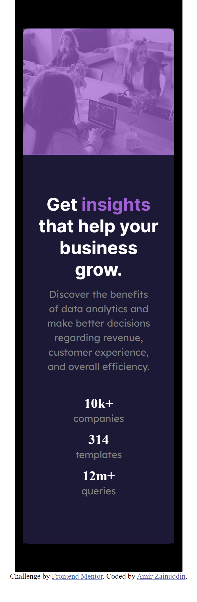

# Frontend Mentor - Stats preview card component solution

This is a solution to the [Stats preview card component challenge on Frontend Mentor](https://www.frontendmentor.io/challenges/stats-preview-card-component-8JqbgoU62). Frontend Mentor challenges help you improve your coding skills by building realistic projects. 

## Table of contents

- [Overview](#overview)
  - [The challenge](#the-challenge)
  - [Screenshot](#screenshot)
  - [Links](#links)
- [My process](#my-process)
  - [Built with](#built-with)
  - [What I learned](#what-i-learned)
  - [Continued development](#continued-development)
- [Author](#author)


## Overview

### The challenge

Users should be able to:

- View the optimal layout depending on their device's screen size

### Screenshot
#### My solution
#### desktop preview


#### desktop design


#### mobile preview



### Links

- Solution URL: [Add solution URL here](https://your-solution-url.com)
- Live Site URL: [live site url](https://amirz25.github.io/Stats-preview-card-component/)

## My process

### Built with

- Semantic HTML5 markup
- CSS custom properties
- Flexbox
- CSS Grid
- Mobile-first workflow


### What I learned

```
Learn to use multiple class in div
div class="main flex_container flex_verticle_align
```

### Continued development

Remember that each selector c use multiple classes


## Author

- Github [Amirz25](https://github.com/Amirz25)
- Frontend Mentor - [@Amirz25](https://www.frontendmentor.io/profile/Amirz25)
- Twitter - [@Amrzai_](https://www.twitter.com/Amrzai_)
